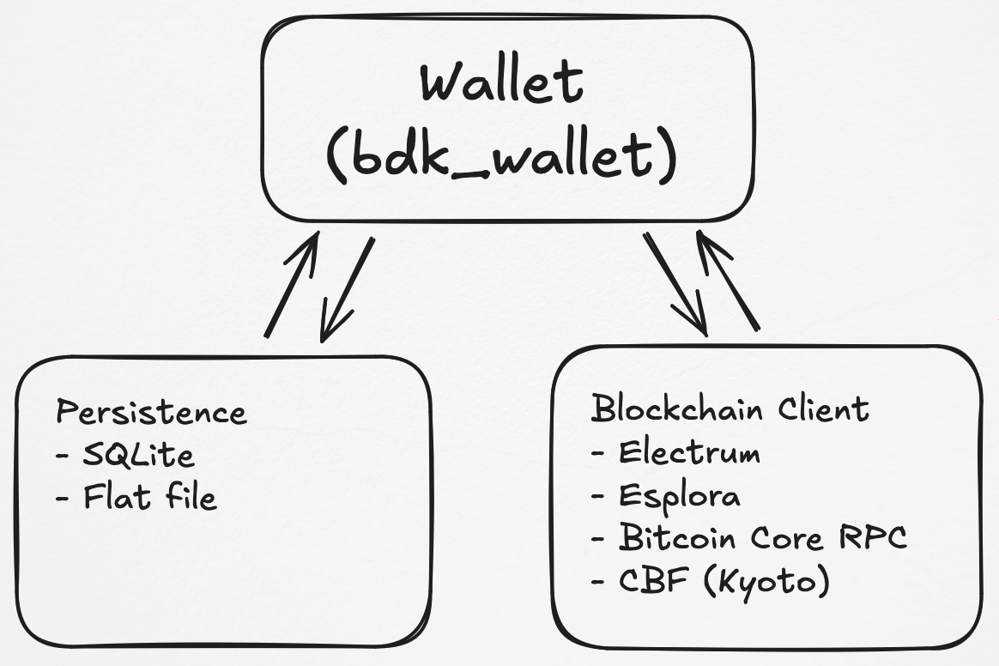

# Building A Wallet With BDK

So you want to build a bitcoin wallet using BDK. Great! Here is the rough outline of what you need to do just that. A standard, simple example of a bitcoin wallet in BDK-land would require 3 core pillars:

1. **The `bdk_wallet` library**, which will provide two core types: the `Wallet` and the `TxBuilder`. This library will handle all the domain logic related to keeping track of which UTXOs you own, what your total balance is, creating and signing transactions, etc.
2. **A blockchain client**. Your wallet will need to keep track of blockchain data, like new transactions that have been added to the blockchain that impact your wallet, requesting these transactions to a Bitcoin Core node, an Electrum or Esplora server, etc.
3. **A persistence mechanism** for saving wallet data between sessions (note that this is not actually required). Things like which addresses the wallet has revealed and what is the state of the blockchain on its last sync are things that are kept in persistence and can be loaded on startup.

<figure markdown="span">
  { width="500" }
  <figcaption>The 3 core pieces of a BDK wallet.</figcaption>
</figure>
